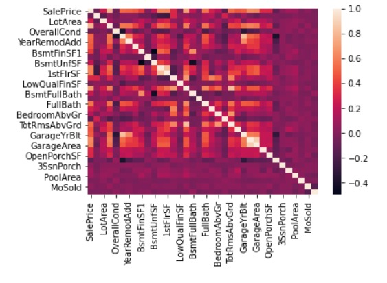
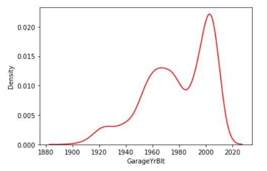
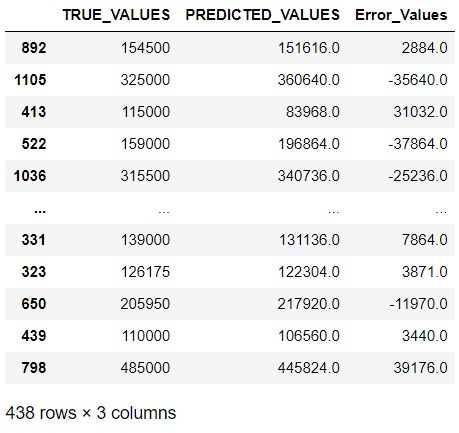

# Price-Prediction-For-a-Dream-Home

ROADMAP TO THIS LINEAR REGRESSION BASED HOUSE PRICE PREDICTION PREDICTION MODEL

1. Import all the dependencies of the project
2. Read dataset and observe features of the dataset carefully.
3. The dataset has over eighty independent variables of dataype float, integer or object. My approach to handle so many features in a model is to plot a correlation matrix for variables and segregate the numerical variables with a stronger positive or negation correlation with the target variable. To visualise the magnitude of correlation a heatmap can also be plot.                                                                                                                                                                        
4. The next step is feature engineering. This include removing null values and outliers from the dataset. The null values or NA values in dataset are observed carefully. Later, a normality curve is plot to observe the skewed behaviour of feature to choose right quantity for adjusting empty cells in dataset. Also, some of the variables have almost more than seventy percent instances as null values. Those features are dropped from the dataframe.                                                                                            
5. Similary, The object datatype variables are append through the value count. That is the category with highest mode is used to substitue null values.
6. Next step involve combining the two dataframes that is one that contain numerical variables and other that contain categorical variables together. The final dataframe is further proccessed by creating dummy variables to give as input train dataset.
7. Now, the dataset is split using the train_test_split method of scikit learn.
8. Train dataset is fed into the model for training by importing the Linear Regression model of scikit learn.
9. The model is trained successfully!
10. The sale price is predicted and displayed against true price for comparision. The predicted price values are very close to the actual values.                                                                   
11. NEXT, step involve model evaluation. In machine learning trained models are evaluated through cost functions. The most popular cost functions used tor evaluating linear regression based machine learning models is to use RMSE, MSE or MAE methods. Smaller the magnitude of cost function lesser is the residual of model or better is the model.
12. Also, in machine learning a weight is associated to each feature. That very coefficient magnitude is calculated either using gradient descent or normal equation method. The magnitude of the coefficients for all the features is calculated.
13. Finally, the evaluated model is stored in pickle.            

--------------------X---------------------X--------------------X--------------------X--------------------X-------------------X---------------------
